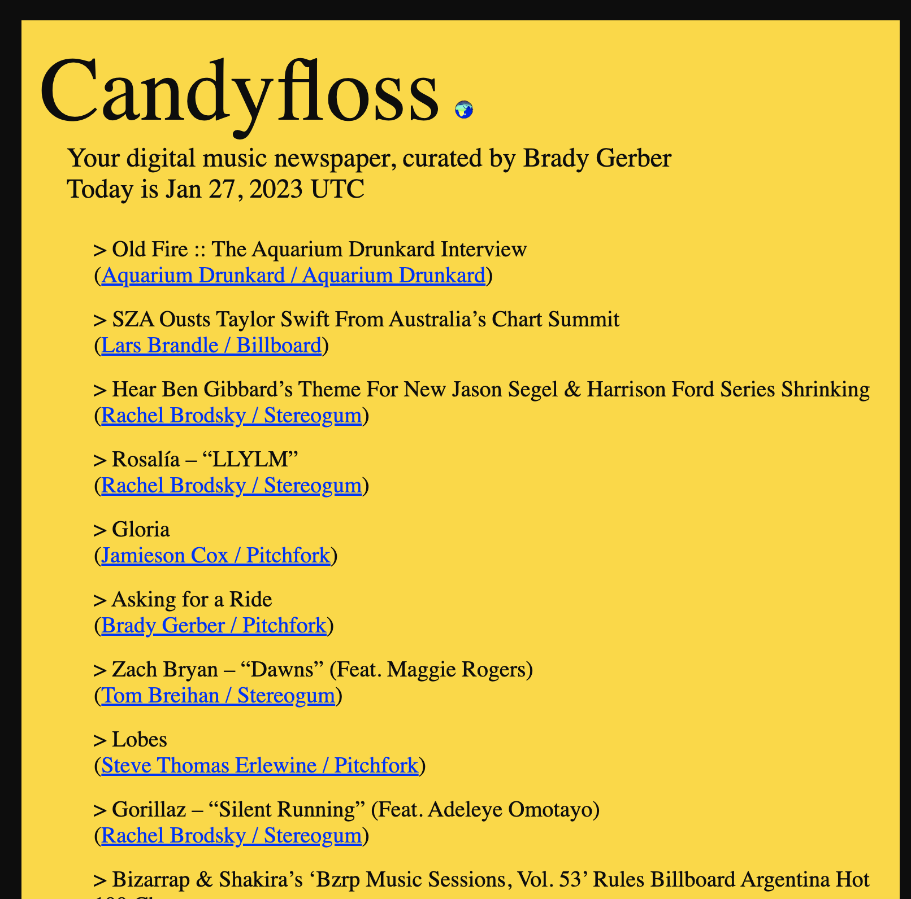

# Candyfloss: The music news of the day curated by Brady Gerber

[](https://github.com/bg-write/candyfloss-flask/issues)



## Candyfloss Explained in One Sentence

Hacker News but for music.

## Candyfloss Explained in One Minute

**Candyfloss** is a digital daily newspaper curating the best music news and longform writing (and occasional sports link). Now you don't need Twitter to keep up on the music world. Candyfloss's styling is inspired by the print covers of the London Review of Books and has a strict cut-off point to fight against the endless scroll.

Candyfloss displays the 50 most recent links from several outlets (full list below) and is set to refresh at the top of every hour. All you have to do is open Candyfloss, click on whatever links you want, and enjoy!

## The Problem

As a music journalist, I read _a lot_ of media. Social media is an easy way to keep track of new content from my favorite writers and outlets on various types of media: websites, newsletters, video channels, and more. I'm also trying to spend less time on social media. So I thought: is there a way to still see all the links I want without the baggage of social media?

## The Solution

I essentially created my own RSS reader as a simple web app that's meant to be shared with my colleagues.

## The Goal

Right now, Candyfloss feels like a complement to Twitter. After adding more outlets and making the code's web scraping more flexible and efficient, the goal is to replace Twitter (at least for how you get your music news).

## The Ideal User

A fellow music journalist or music fan who wants to discover some of the best music writing today without having to be on social media.

## Why Python?

Python is one of my favorite languages; I love its balance of power and simplicity. I mostly work in JavaScript and wanted more hands-on work with Python, so I decided to use Python to make something I would use myself. I also wanted to learn Beautiful Soup, a neat Python library for parsing structured data.

I deployed Candyfloss as a Flask app via PythonAnywhere, which allows me to host the app on a separate domain and keep track of basic analytics with an affordable paid account. (In my experience, PythonAnywhere is easier to work with than Heroku and AWS, though it's not as powerful or flexible and only works with Python; it's perfect for this project and recommended for most simple web apps.)

---

## Getting Started (On Your Local Machine)

The deployed app: <https://www.candyfloss.app/>

In your IDE of choice, in an open terminal window, enter and run `flask --debug run` and open the development server URL provided in the terminal output.

## Candyfloss (Local Instance) API

To view the API for the entire feed, at the end of the local server URL, add "/api."

To view the API for a specific publication, the route is "/api/OUTLET" (i.e. "/api/Pitchfork"). For now, case does matter i.e. "Pitchfork" needs to be uppercase. Please see the bottom "The Ever-Evolving List of Outlets Featured On Candyfloss" section to see what publications are currently available to view on the API and how to spell them.

## Running Tests

In a new terminal window, enter and run `pytest -v`. Pytest is testing `app.py` itself and each feed file found in the `feeds` folder. (More testing to come.)

---

## How Does Candyfloss Work?

### 1) Find and Test the RSS URLs

I first find a working RSS feed for a publication. If a website doesn't promote its own RSS, I can usually find it by typing "/rss" or "/feed" at the end of a URL, or use Google's "RSS Subscription Extension" Chrome plugin. (To publications that make their RSS feeds easy to find: Thank you!)

### 2) Create a Publication's Feed

Each file in the `feeds` folder is where I use Beautiful Soup, requests, and lxml to call and clean up the RSS for each publication.

**"Get" the soup**: make my GET request using requests, Beautiful Soup, and lxml (for genuine web scraping when RSS is not available):

```python
def get_soup():
    html_text = requests.get(
        'RSS URL', timeout=10).text
    return BeautifulSoup(html_text, 'xml')


soup = get_soup()
```

**"Cook" the soup**: pinpoint the repeating element holding the content that I wish to pull from:

```python
def cook_soup():  # each article is in an <item/>
    return soup.find_all('item')


articles = cook_soup()
```

**"Deliver" the soup**: use a for loop to append the info I need into my empty lists, which I then combine into a new dict, which looks like:

```python
PUBLICATION = [
    {'idx': idx,
     'title': title,
     'URL': URL,
     'author': author,
     'publication': publication,
     'date': date}
    for idx, title, URL, author, publication, date in zip(index_list, title_list, URL_list, author_list, publication_list, date_list)
]
```

REFACTORING NOTES: Since deploying this app, I've refactored these steps to include an "Outlet" class to better abstract the structure and abilities of a publication. `p4k.py` displays how this process began. `p4k_class.py` shows how this process has evolved. Future work will include ways to take more advantage of class methods to simplify repeating logic. It also can be challenging when information is missing, mostly from publications not crediting their authors, or isn't formatted like most RSS feeds. The most common examples of the latter involves time and dates, which I clean up and standardize using Python's `datetime` functionality.

### 3) Combine the Feeds into THE Feed

In `app.py`, I import all the publication feeds, combine them into one feed, and then use a sorting function to order this new feed by each link's date, and slice away any publication links after a set number (which for now is 50). This cleaned-up feed is then rendered into my main app route, along with the current date at any given time.

```python
# combining our feeds
link_dicts = pub1 + pub2 + pub3 + etc

# ordering our combined feed by date
link_dicts_sorted = sorted(link_dicts, key=lambda i: i['date'], reverse=True)

# reducing our feed to return a specific set number
link_dicts_sorted_and_reduced = link_dicts_sorted[0:50]
```

---

## Candyfloss's Architecture

- `feeds`: Holds the web scraping for each publication
- `static`: Holds my used images and `styles.css`
- `templates`: The HTML you see on the browser
- `tests`: Where I test `app.py` and `feeds` using pytest
- `app.py`: where I combine the feeds into one clean and organized feed, then rendered to `templates`

---

## Candyfloss Style Guide

### CSS

Candyfloss's CSS is all done in `styles.css` and is inspired by the print covers of the London Review of Books. Media queries are currently set for break points at 992px (most iPads and Surface Pros), 600px (most iPhones and Samsung Galaxies), and 360px (for the Galaxy Fold). Color CSS variables are defined as:

```CSS
--black: #0d0d0d;
--white: #ffffff;
--gold: #ffd900;
--blue: #0026ff;
```

### The Code Itself

Candyfloss follows [Google's Python style guide](https://google.github.io/styleguide/pyguide.html) as closely as possible. This involves:

- Using `pylint` for automated code linting
- Using `yapf` for auto-formatting
- Including Google's settings file for Vim and `pylintrc`

### Accessibility

The deployed Candyfloss app received an overall pass on mobile and desktop Lighthouse reports. Areas of improvement include addressing the performance on mobile due to speeds of first contentful paint, time to interactive, and total blocking time.

Desktop:

- Performance: 100
- Accessibility: 100
- Best Practice: 92
- SEO: 90

Mobile:

- Performance: 84
- Accessibility: 100
- Best Practice: 92
- SEO: 92

---

## Tech Stack & Tools

- [Python](https://www.python.org/) (3.8.6)
- [Flask](https://flask.palletsprojects.com/en/2.2.x/)
- [Beautiful Soup](https://beautiful-soup-4.readthedocs.io/en/latest/)
- [Requests](https://requests.readthedocs.io/en/latest/)
- [lxml](https://lxml.de/)
- [pytest](https://docs.pytest.org/en/7.2.x/)
- [pylint](https://pylint.org/)
- [yapf](https://pypi.org/project/yapf/)
- [Visual Studio Code](https://code.visualstudio.com/docs/languages/python)
- [PythonAnywhere](https://www.pythonanywhere.com/)
- Google's "[RSS Subscription Extension](https://chrome.google.com/webstore/detail/rss-subscription-extensio/nlbjncdgjeocebhnmkbbbdekmmmcbfjd)" Chrome plugin
- [Icons8](https://icons8.com/) (for the current corn favicon)

More can be found in `requirements.txt`

---

## Next Steps (my "Icebox")

- Update `pytest` to now account for object refactoring and more closely follow Google's Python style guide
- Utilize class methods to further abstract some of my repeating logic when building and cleaning up feeds
- Connect the API to a database to then dynamically change what my app feed displays (starting with SQLite and SQLAlchemy)
- Refactor older feed files to incorporate my new class structures
- Add more publications!
- Are there too many links on the UI?
- Flesh out the app's overall metadata
- Add a search field on the UI
- Expand upon the current 404 page
- Any way to utilize relative data analysis or machine learning?

---

## How Can You Contribute?

Any way you can! I'm especially looking for help to flesh out my Python automated testing, and suggestions on new outlets I should add to Candyfloss.

---

## The Ever-Evolving List of Outlets Featured On Candyfloss

- Pitchfork (album reviews)
- Stereogum (new music links)
- Aquarium Drunkard (latest posts)
- The Ringer (music section)
- Fluxblog (substack)
- Music Journalism Insider (substack)
- Penny Fractions (ghost)
- Chicago Reader (Gossip Wolf column)
- Uproxx (music section)
- Abundant Living (ghost)
- Billboard (Chart Beat column)
- No Bells (latest posts)
- The Quietus (reviews)
- Loud And Quiet (reviews)
- No Depression (reviews)
- So It Goes (substack)
- Reply Alt (substack)
- Wire (In Writing column)
- Passion of the Weiss (latest posts)
- New York Times (music section)
- The Guardian (music section)

---

## Closing Credits

A special shout-out to Nish Tahir for giving thoughtful feedback on an early version of this app. [Pallets's intro to Flask](https://flask.palletsprojects.com/en/2.2.x/quickstart/) is a recommended starting point for anyone wanting to explore Flask. [Waweru Mwaura](https://circleci.com/blog/testing-flask-framework-with-pytest/) has a great blog post on the basics of using pytest with Flask. I also want to thank [Magnitopic](https://www.youtube.com/@Magnitopic) for their helpful [YouTube video](https://www.youtube.com/watch?v=AZMQVI6Ss64) on how to deploy a Flask app to PythonAnywhere.

---

© 2023 Brady Gerber. All Rights Reserved.
