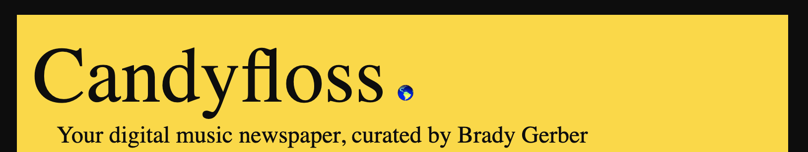

# Candyfloss: The music news of the day curated by Brady Gerber

[](https://github.com/bg-write/candyfloss-flask/issues)



## Candyfloss Explained in One Sentence

Hacker News, but only about music.

## Candyfloss Explained in One Minute

**Candyfloss** is a digital daily newspaper curating the best music news and longform writing (and occasional sports link). Now you don't need Twitter to keep up on the music world. Candyfloss's styling is inspired by the print covers of the London Review of Books.

Candyfloss displays the 50 most recent links from several outlets (full list below) and is set to refresh at the top of every hour. All you have to do is open up Candyfloss, click on whatever links you want, and enjoy!

## The Problem

As a music journalist, I read a lot of media. Social media is an easy way to keep track of new links from my favorite writers and outlets found on various types of media: websites, newsletters, video channels, and more. I'm trying to spend less time on social media. So I thought: is there a way to still see all the links I want without the baggage of social media?

## The Solution

I essentially created my own RSS reader, but as a web app that's meant to be shared with my colleagues, and styled to be simple and only show a set amount of links to fight the endless scroll.

## The Goal

Right now, Candyfloss feels like a complement to Twitter. After adding more outlets and making the code's web scraping more flexible and efficient, the goal is to replace Twitter (at least for how you get your music news).

## The Ideal User

A fellow music journalist or music fan who wants to discover some of the best music writing today without having to be on social media.

## Why Python?

Python is one of my favorite languages; I love its balance of power and simplicity. I mostly work in JavaScript and wanted more hands-on work with Python, so I decided to use Python to make something I would actually use myself. I also wanted to learn Beautiful Soup, a cool Python library for parsing structured data.

I deployed Candyfloss as a Flask app via PythonAnywhere, which allows me to host the app on a separate domain and keep track of basic analytics with an affordable paid account. (In my experience, PythonAnywhere is easier to work with than Heroku and AWS, though it's not as powerful or flexible and only works with Python.)

---

## Getting Started (On Your Local Machine)

The deployed app: <https://www.candyfloss.app/>

In your IDE of choice, in an open terminal window, enter and run `flask --debug run` and open the development server URL provided in the terminal output.

## Candyfloss (local) API

To view the API for the entire feed, at the end of the local server URL, add "/api." (The rendered feed only displays the most recent 50 links.)

## Running Tests

In a new terminal window, enter and run `pytest`. Pytest is testing `app.py` itself and each feed file found in the `feeds` folder.

---

## How Does Candyfloss Work?

### 1) Find and Test the RSS URLs

I first find a working RSS feed for a publication. If a website doesn't promote its own RSS, I can usually find it by typing "/rss" or "/feed" at the end of a URL, or use Google's "RSS Subscription Extension" Chrome plugin.

(To publications that make their RSS feeds easy to find: Thank you!)

### 2) Create a Publication's Feed

Each file in the `feeds` folder is where I use Beautiful Soup, requests, and lxml to call and clean up the RSS for each publication.

**"Get" the soup**: make my GET request using requests, Beautiful Soup, and lxml (for genuine web scraping when RSS is not available)

```python
def get_soup():
    html_text = requests.get(
        'RSS URL').text
    return BeautifulSoup(html_text, 'xml')


soup = get_soup()
```

**"Cook" the soup**: pinpoint the repeating element holding the content I wish to pull from

```python
def cook_soup():  # each article is in an <item/>
    return soup.find_all('item')


articles = cook_soup()
```

**"Deliver" the soup**: use a `for` loop to append the info I need into my empty lists, which I then combine into a new dict, which looks like:

```python
PUBLICATION = [
    {'idx': idx,
     'title': title,
     'URL': URL,
     'author': author,
     'publication': publication,
     'date': date}
    for idx, title, URL, author, publication, date in zip(index_list, title_list, URL_list, author_list, publication_list, date_list)
]
```

It can be challenging when information is missing (mostly publications not crediting their authors) or isn't formatted like most RSS feeds (i.e. time and dates, which I then clean up and standardize via Python's `datetime` functionality).

### 3) Combine the Feeds into THE Feed

In `app.py`, I import all the feed dicts, combine them into one new dict, and then use a sorting function to order this new overall feed by each link's date, and slice away any publications after a set number (which, for now, is 50). This cleaned-up feed is then rendered into my main app route, along with the current date at any given time.

```python
# combining our feeds
link_dicts = pub1 + pub2 + pub3 + etc

# ordering our combined feed by date
link_dicts_sorted = sorted(link_dicts, key=lambda i: i['date'], reverse=True)

# reducing our feed to return a specific set number
link_dicts_sorted_and_reduced = link_dicts_sorted[0:50]
```

---

## Candyfloss's Architecture

- `feeds`: the web scrapping files for each publication and an overall test file (currently moving into the top level)
- `static`: my used images and my overall `styles.css` file
- `templates`: The actual web templates you see on the browser
- `app.py`: where I combine all my feeds into one cleaned up and organized feed and render it to `hello.html` in the `templates` folder
- `test_app.py`: Where I test my new variables created on `app.py`.

## Tech Stack & Tools

- Python (3.8.6)
- Flask
- Beautiful Soup
- Requests
- lxml
- pytest
- Visual Studio Code
- PythonAnywhere
- Google's "RSS Subscription Extension" Chrome plugin
- Icons8 (for the current corn favicon)

More can be found in `requirements.txt`

---

## Next Steps (my "Icebox")

- Add automated lint and code style enforcement and further utilize pycodestyle
- Adopt Google's Python coding convention & style guide <https://google.github.io/styleguide/pyguide.html>
- Move my tests out into the overall Test folder
- Use classes to further abstract out some of my repeating logic. A DataSource class? Having properties for feedurl and implementing get_soup?
- Add a DB where I keep the list of data sources I want to pull from - to dynamically change what my feed displays, without having to change code
- Are there too many links?
- Any way to utilize data analysis, machine learning, or even game logic without going overkill?
- Flesh out metadata
- Add a search field for my feed of publications

---

## How Can YOU Contribute?

Any way you can! I'm especially looking for:

- Help to flesh out my Python automated testing
- Suggestions on new outlets I should add to Candyfloss ... bonus points if you can add them yourself!

---

## The Ever-Evolving List of Outlets Featured On Candyfloss

- Pitchfork (album reviews)
- Stereogum (new music)
- Aquarium Drunkard (latest posts)
- The Ringer (music section)
- Fluxblog (substack)
- Music Journalism Insider (substack)
- Penny Fractions (ghost)
- Chicago Reader (Gossip Wolf column)
- Uproxx (music section)
- Abundant Living (ghost)
- Billboard (chart beat)
- No Bells (latest posts)
- The Quietus (reviews)
- Loud And Quiet (reviews)
- No Depression (reviews)
- So It Goes (substack)
- Reply Alt (substack)

---
  
## Closing Credits

A special shout-out to Nish Tahir for giving some excellent and thoughtful feedback on an early version of this app. [Pallets's  intro to Flask](https://flask.palletsprojects.com/en/2.2.x/quickstart/) is a recommended starting point for anyone wanting to explore Flask. I also wish to thank [Magnitopic](https://www.youtube.com/@Magnitopic) for their helpful [YouTube video](https://www.youtube.com/watch?v=AZMQVI6Ss64) on how to deploy a Flask app to PythonAnywhere.

---

© 2022 Brady Gerber. All Rights Reserved.
